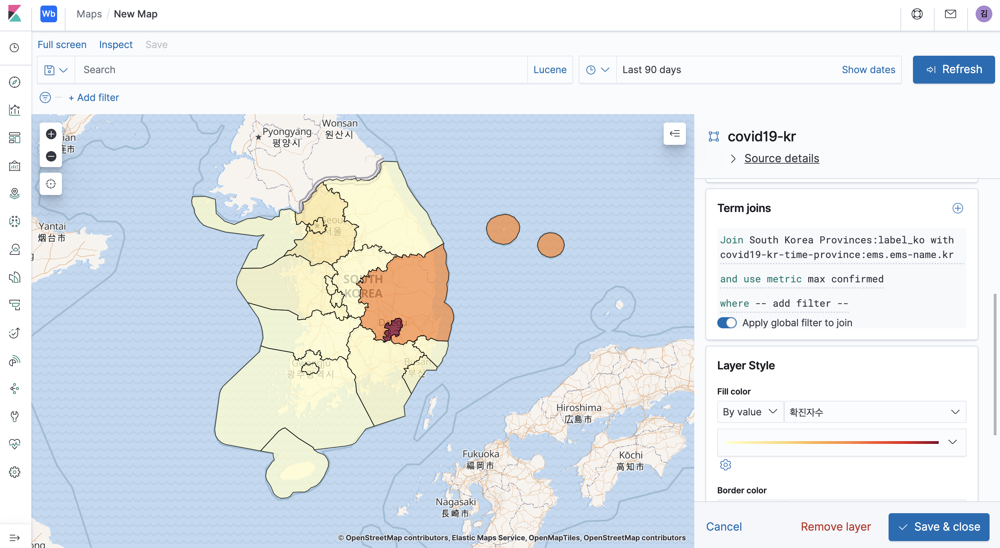
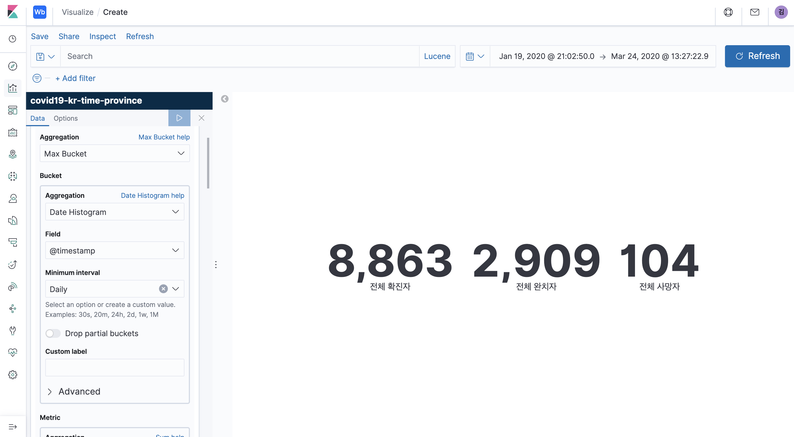
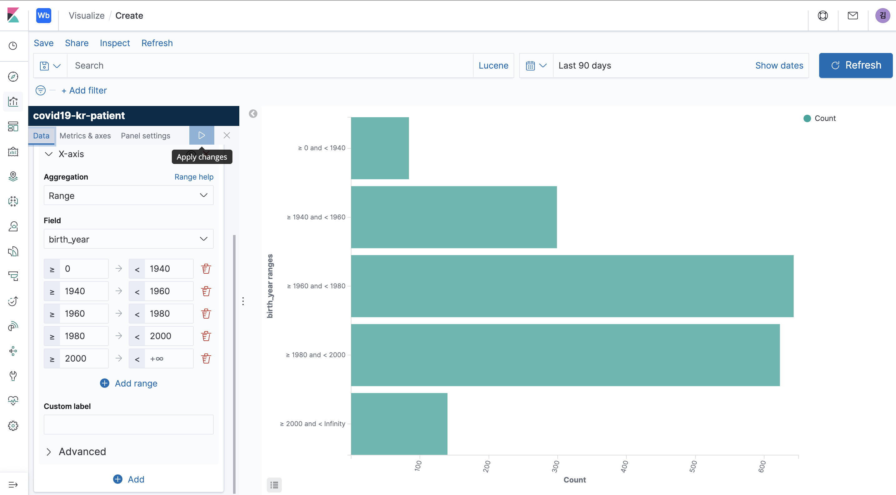
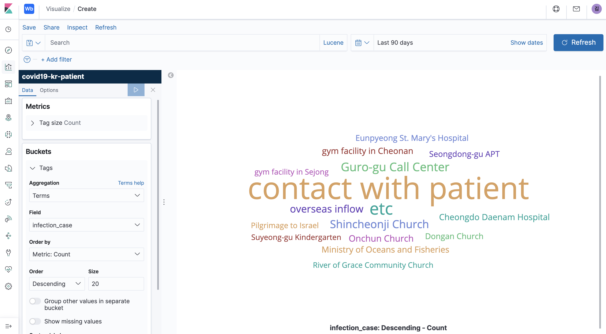
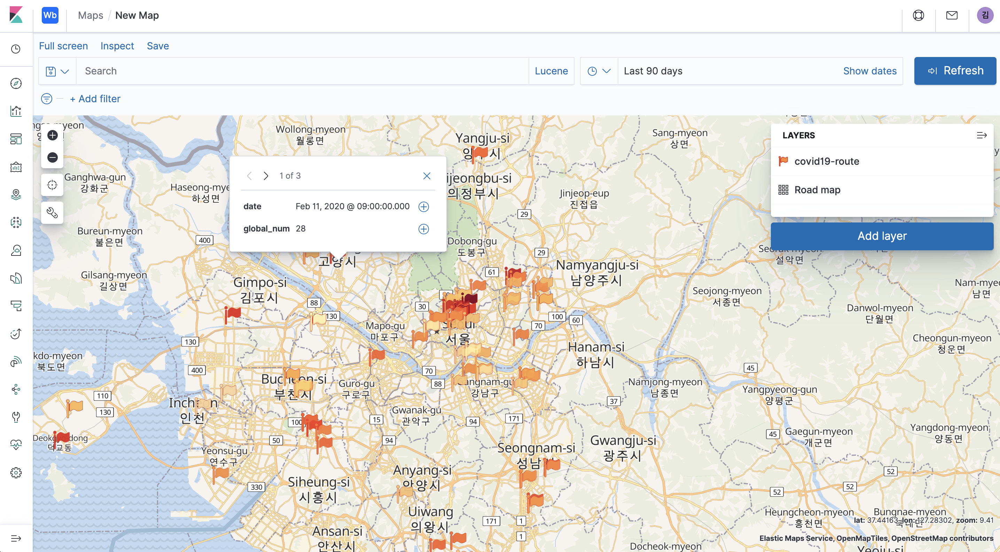

# Create COVID19 Dashboard with Elastics Stack South Korea Cases

* Data Source - https://www.kaggle.com/kimjihoo/coronavirusdataset

## TimeProvince.csv
* Use Data Visualizer for index.
* Index Name : `covid19-kr-time-province`
* uncheck Create Index pattern
* Mappings
```
{
  "@timestamp": {
    "type": "date"
  },
  "confirmed": {
    "type": "integer"
  },
  "date": {
    "type": "date",
    "format": "iso8601"
  },
  "deceased": {
    "type": "integer"
  },
  "province": {
    "type": "keyword"
  },
  "released": {
    "type": "integer"
  },
  "time": {
    "type": "byte"
  }
}
```

### Prepare for Map Visualzations

#### Convert province field value into values used in Elastic Map Service

Elastic Map Service : https://maps.elastic.co/#file/south_korea_provinces

* Create Index : `south-korea-province`
```
PUT south-korea-province
{
  "mappings": {
    "properties": {
      "covid19-name": {
        "type": "keyword"
      },
      "ems-name": {
        "properties": {
          "kr": {
            "type": "keyword"
          },
          "en": {
            "type": "keyword"
          }
        }
      }
    }
  }
}
```

* Insert docments into `south-korea-province` index, suing Bulk API
  * `covid19-name` : value of province field from TimeProvince.csv file.
  * `ems-name { en, kr}` : values defined in Elastic Map Service - South Korea Provinces
```
POST south-korea-province/_bulk
{"index":{"_id":"KR-26"}}
{"covid19-name":"Busan","ems-name":{"en":"Busan","kr":"부산광역시"}}
{"index":{"_id":"KR-43"}}
{"covid19-name":"Chungcheongbuk-do","ems-name":{"en":"North Chungcheong Province","kr":"충청북도"}}
{"index":{"_id":"KR-44"}}
{"covid19-name":"Chungcheongnam-do","ems-name":{"en":"South Chungcheong Province","kr":"충청남도"}}
{"index":{"_id":"KR-27"}}
{"covid19-name":"Daegu","ems-name":{"en":"Daegu","kr":"대구광역시"}}
{"index":{"_id":"KR-30"}}
{"covid19-name":"Daejeon","ems-name":{"en":"Busan","kr":"대전광역시"}}
{"index":{"_id":"KR-42"}}
{"covid19-name":"Gangwon-do","ems-name":{"en":"Gangwon Province","kr":"강원도"}}
{"index":{"_id":"KR-29"}}
{"covid19-name":"Gwangju","ems-name":{"en":"Gwangju","kr":"광주광역시"}}
{"index":{"_id":"KR-41"}}
{"covid19-name":"Gyeonggi-do","ems-name":{"en":"Gyeonggi Province","kr":"경기도"}}
{"index":{"_id":"KR-47"}}
{"covid19-name":"Gyeongsangbuk-do","ems-name":{"en":"North Gyeongsang Province","kr":"경상북도"}}
{"index":{"_id":"KR-48"}}
{"covid19-name":"Gyeongsangnam-do","ems-name":{"en":"South Gyeongsang Province","kr":"경상남도"}}
{"index":{"_id":"KR-28"}}
{"covid19-name":"Incheon","ems-name":{"en":"Incheon","kr":"인천광역시"}}
{"index":{"_id":"KR-49"}}
{"covid19-name":"Jeju-do","ems-name":{"en":"Jeju","kr":"제주특별자치도"}}
{"index":{"_id":"KR-45"}}
{"covid19-name":"Jeollabuk-do","ems-name":{"en":"North Jeolla Province","kr":"전라북도"}}
{"index":{"_id":"KR-46"}}
{"covid19-name":"Jeollanam-do","ems-name":{"en":"South Jeolla Province","kr":"전라남도"}}
{"index":{"_id":"KR-50"}}
{"covid19-name":"Sejong","ems-name":{"en":"Sejong City","kr":"세종특별자치시"}}
{"index":{"_id":"KR-11"}}
{"covid19-name":"Seoul","ems-name":{"en":"Seoul","kr":"서울특별시"}}
{"index":{"_id":"KR-31"}}
{"covid19-name":"Ulsan","ems-name":{"en":"Ulsan","kr":"울산광역시"}}
```

#### Create enrich ingest pipeline

* _enrich policy
```
PUT _enrich/policy/covid19-province
{
  "match": {
    "indices": "south-korea-province",
    "match_field": "covid19-name",
    "enrich_fields": [
      "ems-name"
    ]
  }
}

POST _enrich/policy/covid19-province/_execute
```

* Ingest Pipeline
```
PUT _ingest/pipeline/covid19-province-convert
{
  "description": "Convert province field to matching EMS value",
  "processors": [
    {
      "enrich": {
        "policy_name": "covid19-province",
        "field": "province",
        "target_field": "ems",
        "max_matches": "1"
      }
    }
  ]
}
```

* Update index with enrich processor
```
PUT covid19-kr-time-province/_mapping
{
  "properties": {
    "ems": {
      "properties": {
        "covid19-name": {
          "type": "keyword"
        },
        "ems-name": {
          "properties": {
            "en": {
              "type": "keyword"
            },
            "kr": {
              "type": "keyword"
            }
          }
        }
      }
    }
  }
}

POST covid19-kr-time-province/_update_by_query?pipeline=covid19-province-convert
```

<!-- to reset all, run follow commands in order
DELETE covid19-kr-time-province
DELETE _ingest/pipeline/covid19-province-convert
DELETE _enrich/policy/covid19-province
DELETE south-korea-province
-->

### Area Chart - Timeseriesd confirmed per provinces


#### Matrics
* Y-axis
  * Aggregation : `Max`
  * Field : `Confirmed`

#### Buckets 
* X-axis
  * Aggergation : Date Histogram / `@timestamp`
  * Minimaym Interval : `Daily`
* Add - Split Series
  * Sub Aggregation : `Terms`
  * Field : `ems.ems-names.kr(en)`
  * Size : 20

### Line Chart - Timeseries Confirmed / Released / Deceased


#### Buckets 
* X-axis
  * Aggergation : Date Histogram / `@timestamp`
  * Minimaym Interval : `Daily`

#### Matrics
* Y-axis
  * Aggregation : `Max` / Field : `Confirmed` / Custom Label : Total Confirmed
* Add Y-axis
  * Aggregation : `Max` / Field : `Released` / Custom Label : Total Released
* Add Y-axis
  * Aggregation : `Max` / Field : `Deceased` / Custom Label : Total Deceased

* Add Y-axis
  * Pipeline Aggregation : `Derivative` / Metric : Total Confirmed / Custom Label : Daily Confirmed
* Add Y-axis
  * Pipeline Aggregation : `Derivative` / Metric : Total Released / Custom Label : Daily Released
* Add Y-axis
  * Pipeline Aggregation : `Derivative` / Metric : Total Deceased / Custom Label : Daily Deceased

#### Metrics & axes

* Y-axes -> +
  * RightAxis-1

* Metrics - Total Confirmed / Total Released / Total Deceased
  * Line mode : `Smoothened`
  * Show dots : disable

* Metrics - Daily Confirmed / Daily Released / Daily Deceased
  * Value axis : `RightAxis-1`
  * Chart type : `Bar`

### Maps - Confirmed regions

> Remember to put Timepicker in valid dates.



* Add Layer : EMS Boundaries
  * Layer : South Korea Provinces
* Tooltip Fields : `name(en)`
* Term Joins
  * Left field : `name(en)`
  * Right Source : covid19-kr-time-province
  * Right field : `ems.ems-name.en`
  * and use metric
    * Aggregation : Max
    * Field : Confirmed
    * Custom Label : Confirmed
* Layer Style
  * Fill color : By value : Confirmed
  * Border color : if needed

### Metric - Total Confirmed / released / deceased



* Aggregation : `Max Bucket`
* Bucket : 
  * Aggergation : `Date Historgam`
  * Field : `@timestamp`
  * Minimum interval : `Daily`
* Metric : 
  * Aggregation : `Sum`
  * Field : `confirmed`

iterate with `released`, `deceased`.


## PatientInfo.csv

> Notice : This file does not contains full numbers of pationts.
* Use Data Visualizer for index.
* Index Name : `covid19-kr-patient-info`
* Mappings
```
{
  "age": {
    "type": "keyword"
  },
  "birth_year": {
    "type": "short"
  },
  "city": {
    "type": "keyword"
  },
  "confirmed_date": {
    "type": "date",
    "format": "iso8601"
  },
  "contact_number": {
    "type": "keyword"
  },
  "country": {
    "type": "keyword"
  },
  "deceased_date": {
    "type": "date",
    "format": "iso8601"
  },
  "disease": {
    "type": "keyword"
  },
  "global_num": {
    "type": "integer"
  },
  "infected_by": {
    "type": "keyword"
  },
  "infection_case": {
    "type": "keyword"
  },
  "infection_order": {
    "type": "byte"
  },
  "patient_id": {
    "type": "keyword"
  },
  "province": {
    "type": "keyword"
  },
  "released_date": {
    "type": "date",
    "format": "iso8601"
  },
  "sex": {
    "type": "keyword"
  },
  "state": {
    "type": "keyword"
  },
  "symptom_onset_date": {
    "type": "date",
    "format": "iso8601"
  }
}
```

### Pie Chart - By Gender


#### Bucket
  * Aggregation : Terms
  * Field : sex
  * Show missing values : enable


### Horizontal Bar Chart - By ages



#### Bucket
* X-axis
  * Aggregation : `Range`
  * Field : `birty_year`
  * 0-1940 / 1940-1960 / 1960-1980 / 1980-2000 / 2000-

### Tag Cloud - Infection Cases



#### Buckets
* Tags
  * Aggregation : `terms`
  * Field : `infection_case`
  * Size : 20


## PatientInfo.csv

* Use Data Visualizer for index.
* Index Name : `covid19-kr-patient-route`
* uncheck Create Index pattern
* Mappings
```
{
  "@timestamp": {
    "type": "date"
  },
  "city": {
    "type": "keyword"
  },
  "date": {
    "type": "date",
    "format": "iso8601"
  },
  "global_num": {
    "type": "short"
  },
  "patient_id": {
    "type": "keyword"
  },
  "province": {
    "type": "keyword"
  },
  "location": {
    "type": "geo_point"
  }
}
```

* pipeline
```
{
  "description": "Ingest pipeline created by file structure finder",
  "processors": [
    {
      "date": {
        "field": "date",
        "timezone": "{{ beat.timezone }}",
        "formats": [
          "ISO8601"
        ]
      }
    },
    {
      "set": {
        "field": "location.lat",
        "value": "{{latitude}}"
      }
    },
    {
      "set": {
        "field": "location.lon",
        "value": "{{longitude}}"
      }
    },
    {
      "remove": {
        "field": "latitude"
      }
    },
    {
      "remove": {
        "field": "longitude"
      }
    }
  ]
}
```

### Maps - Routes



* Add Layer : Documents
* Tooltip Fields : `date`, `global_num`
* Layer Style : Icon : embassy
* Fill Color : by Value : `date`

### Apply EMS fields to make queryable with other visualizations

* Update index with enrich processor.
```
PUT covid19-kr-patient-route/_mapping
{
  "properties": {
    "ems": {
      "properties": {
        "covid19-name": {
          "type": "keyword"
        },
        "ems-name": {
          "properties": {
            "en": {
              "type": "keyword"
            },
            "kr": {
              "type": "keyword"
            }
          }
        }
      }
    }
  }
}

POST covid19-kr-patient-route/_update_by_query?pipeline=covid19-province-convert
```