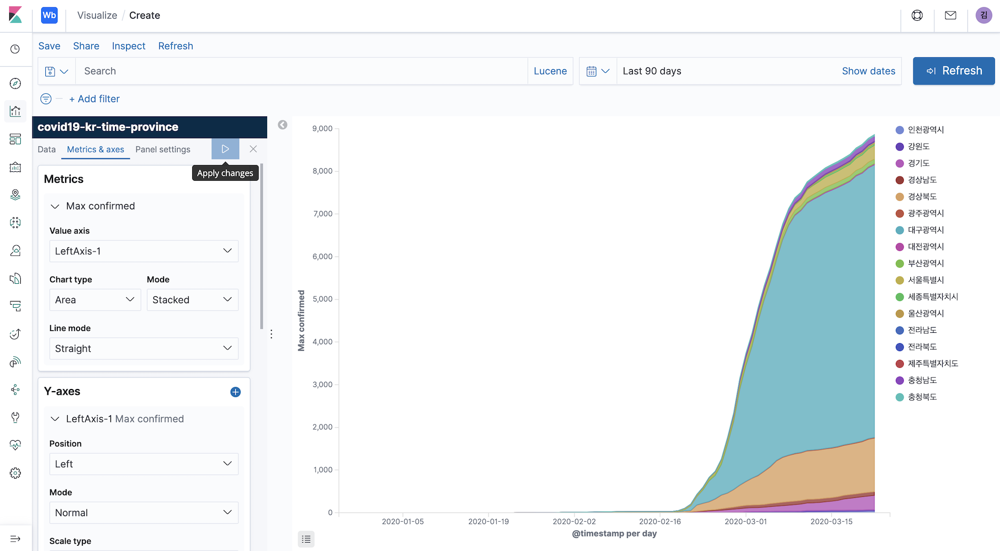
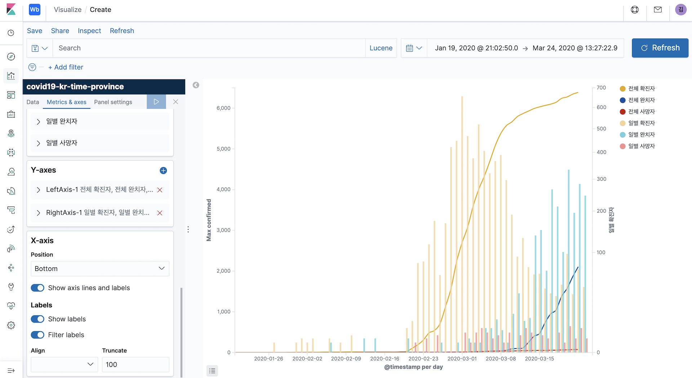

# 2020-03-24 Virtual Meetup - Elastics Stack을 이용한 COVID19 대시보드 만들기

* 데이터 다운로드 - https://www.kaggle.com/kimjihoo/coronavirusdataset

## covid19-kr-time-province

* Kibana 의 파일 업로드 기능 이용.
* Create Index pattern 체크 해제
* Mappings
```
{
  "@timestamp": {
    "type": "date"
  },
  "confirmed": {
    "type": "integer"
  },
  "date": {
    "type": "date",
    "format": "iso8601"
  },
  "deceased": {
    "type": "integer"
  },
  "province": {
    "type": "keyword"
  },
  "released": {
    "type": "integer"
  },
  "time": {
    "type": "byte"
  }
}
```

### 지역정보 시각화 준비

#### province 필드를 Elastic Map Service 에서 사용하는 값으로 변환

Elastic Map Service : https://maps.elastic.co/#file/south_korea_provinces

* south-korea-province 인덱스 생성
```
PUT south-korea-province
{
  "mappings": {
    "properties": {
      "covid19-name": {
        "type": "keyword"
      },
      "ems-name": {
        "properties": {
          "kr": {
            "type": "keyword"
          },
          "en": {
            "type": "keyword"
          }
        }
      }
    }
  }
}
```

* south-korea-province 인덱스에 값 입력.
  * covid19-name : TimeProvince.csv 파일의 province 필드 값
  * ems-name { en, kr} : Elastic Map Service 의 South Korea Provinces 맵에 매칭되는 값
```
POST south-korea-province/_bulk
{"index":{"_id":"KR-26"}}
{"covid19-name":"Busan","ems-name":{"en":"Busan","kr":"부산광역시"}}
{"index":{"_id":"KR-43"}}
{"covid19-name":"Chungcheongbuk-do","ems-name":{"en":"North Chungcheong Province","kr":"충청북도"}}
{"index":{"_id":"KR-44"}}
{"covid19-name":"Chungcheongnam-do","ems-name":{"en":"South Chungcheong Province","kr":"충청남도"}}
{"index":{"_id":"KR-27"}}
{"covid19-name":"Daegu","ems-name":{"en":"Daegu","kr":"대구광역시"}}
{"index":{"_id":"KR-30"}}
{"covid19-name":"Daejeon","ems-name":{"en":"Busan","kr":"대전광역시"}}
{"index":{"_id":"KR-42"}}
{"covid19-name":"Gangwon-do","ems-name":{"en":"Gangwon Province","kr":"강원도"}}
{"index":{"_id":"KR-29"}}
{"covid19-name":"Gwangju","ems-name":{"en":"Gwangju","kr":"광주광역시"}}
{"index":{"_id":"KR-41"}}
{"covid19-name":"Gyeonggi-do","ems-name":{"en":"Gyeonggi Province","kr":"경기도"}}
{"index":{"_id":"KR-47"}}
{"covid19-name":"Gyeongsangbuk-do","ems-name":{"en":"North Gyeongsang Province","kr":"경상북도"}}
{"index":{"_id":"KR-48"}}
{"covid19-name":"Gyeongsangnam-do","ems-name":{"en":"South Gyeongsang Province","kr":"경상남도"}}
{"index":{"_id":"KR-28"}}
{"covid19-name":"Incheon","ems-name":{"en":"Incheon","kr":"인천광역시"}}
{"index":{"_id":"KR-49"}}
{"covid19-name":"Jeju-do","ems-name":{"en":"Jeju","kr":"제주특별자치도"}}
{"index":{"_id":"KR-45"}}
{"covid19-name":"Jeollabuk-do","ems-name":{"en":"North Jeolla Province","kr":"전라북도"}}
{"index":{"_id":"KR-46"}}
{"covid19-name":"Jeollanam-do","ems-name":{"en":"South Jeolla Province","kr":"전라남도"}}
{"index":{"_id":"KR-50"}}
{"covid19-name":"Sejong","ems-name":{"en":"Sejong City","kr":"세종특별자치시"}}
{"index":{"_id":"KR-11"}}
{"covid19-name":"Seoul","ems-name":{"en":"Seoul","kr":"서울특별시"}}
{"index":{"_id":"KR-31"}}
{"covid19-name":"Ulsan","ems-name":{"en":"Ulsan","kr":"울산광역시"}}
```

#### 색인시 데이터 확장을 위한 enrich pipeline 생성

* _enrich policy 생성 및 활성
```
PUT _enrich/policy/covid19-province
{
  "match": {
    "indices": "south-korea-province",
    "match_field": "covid19-name",
    "enrich_fields": [
      "ems-name"
    ]
  }
}

POST _enrich/policy/covid19-province/_execute
```

* Enrich Ingest Pipeline 생성
```
PUT _ingest/pipeline/covid19-province-convert
{
  "description": "Convert province field to matching EMS value",
  "processors": [
    {
      "enrich": {
        "policy_name": "covid19-province",
        "field": "province",
        "target_field": "ems",
        "max_matches": "1"
      }
    }
  ]
}
```

* Enrich 프로세서를 적용해서 인덱스 값 업데이트
```
PUT covid19-kr-time-province/_mapping
{
  "properties": {
    "ems": {
      "properties": {
        "covid19-name": {
          "type": "keyword"
        },
        "ems-name": {
          "properties": {
            "en": {
              "type": "keyword"
            },
            "kr": {
              "type": "keyword"
            }
          }
        }
      }
    }
  }
}

POST covid19-kr-time-province/_update_by_query?pipeline=covid19-province-convert
```

<!-- 전부 리셋하려면 아래 명령 순서대로 실행
DELETE covid19-kr-time-province
DELETE _ingest/pipeline/covid19-province-convert
DELETE _enrich/policy/covid19-province
DELETE south-korea-province
-->

### Area Chart - 시간대별 지역별 확진자



#### Matrics
* Y-axis
  * Aggregation : `Max`
  * Field : `Confirmed`

#### Buckets 
* X-axis
  * Aggergation : Date Histogram / `@timestamp`
  * Minimaym Interval : `Daily`
* Add - Split Series
  * Sub Aggregation : `Terms`
  * Field : `ems.ems-names.kr(en)`
  * Size : 20

### Line Chart - 시간대별 확진 / 완치 / 사망자



#### Buckets 
* X-axis
  * Aggergation : Date Histogram / `@timestamp`
  * Minimaym Interval : `Daily`

#### Matrics
* Y-axis
  * Aggregation : `Max` / Field : `Confirmed` / Custom Label : 전체 확진자
* Add Y-axis
  * Aggregation : `Max` / Field : `Released` / Custom Label : 전체 완치자
* Add Y-axis
  * Aggregation : `Max` / Field : `Deceased` / Custom Label : 전체 사망자

* Add Y-axis
  * Pipeline Aggregation : `Derivative` / Metric : 전체 확진자 / Custom Label : 일별 확진자
* Add Y-axis
  * Pipeline Aggregation : `Derivative` / Metric : 전체 완치자 / Custom Label : 일별 완치자
* Add Y-axis
  * Pipeline Aggregation : `Derivative` / Metric : 전체 사망자 / Custom Label : 일별 사망자

#### Metrics & axes

* Y-axes -> +
  * RightAxis-1

* Metrics - 전체 확진자 / 전체 완치자 / 전체 사망자
  * Line mode : `Smoothened`
  * Show dots : disable

* Metrics - 일별 확진자 / 일별 완치자 / 일별 사망자
  * Value axis : `RightAxis-1`
  * Chart type : `Bar`
