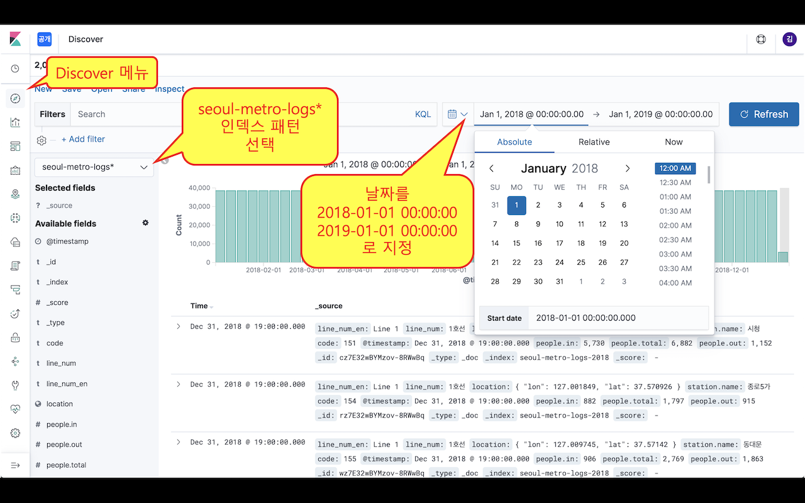

# 공공데이터를 이용한 서울시 지하철 대시보드

[1. 공공데이터로부터 추출, 색인, 매핑 및 템플릿](01-data-process-ingest.md) 로 부터 이어서 진행합니다.

## 2. Kibana 대시보드

유튜브 링크 : Elastic Stack을 이용한 서울시 지하철 대시보드 다시 만들기 #2

### 색인된 데이터 확인

아래 명령으로 데이터 색인이 끝났는지 확인합니다. 전체 `"count" : 2007500`
```
GET seoul-metro-logs-2018/_count
```

### Kibana 인덱스 패턴 생성

- **Management > Kibana : Index Patterns** 메뉴로 이동
- **Create Index Pattern** 버튼 클릭
- **Index pattern** 입력폼에 `seoul-metro-logs*` 입력 후 **Next step** 클릭
- **Time Filter field name** 입력폼에 `@timestamp` 선택 후 **Create index pattern** 버튼 클릭

seoul-metro-logs* 인덱스 패턴이 생성 된 후 Discover 메뉴에서 데이터를 확인합니다.
- Discover 메뉴로 이동합니다.
- 저장된 인덱스 패턴 중 `seoul-metro-logs*` 를 선택합니다.
- 타임피커에서 날짜를 `2018-01-01` ~ `2019-01-01` 로 선택합니다.



